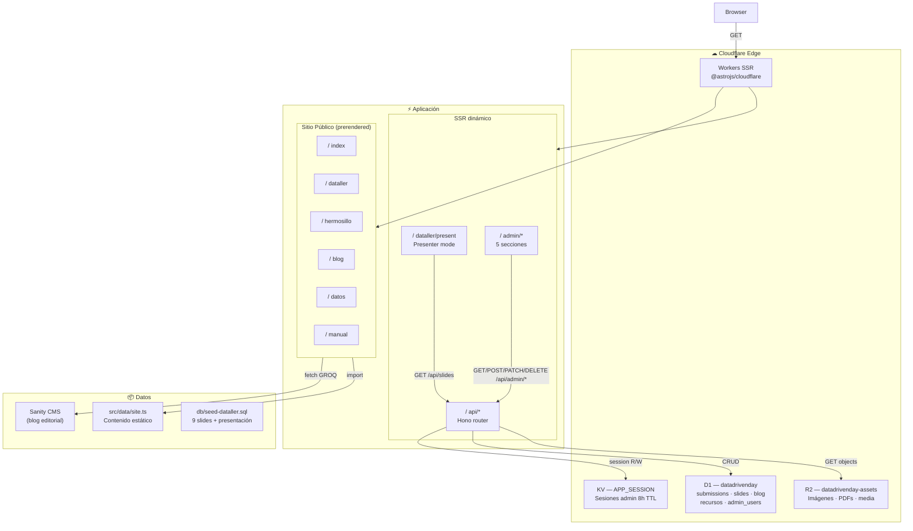
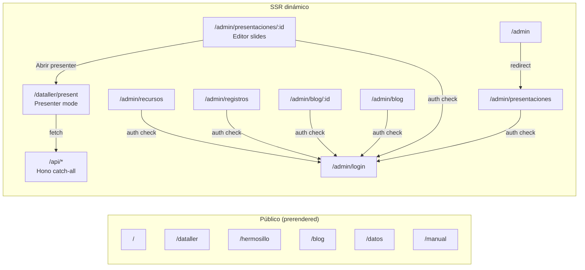
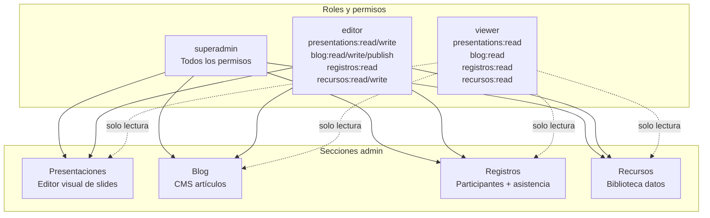
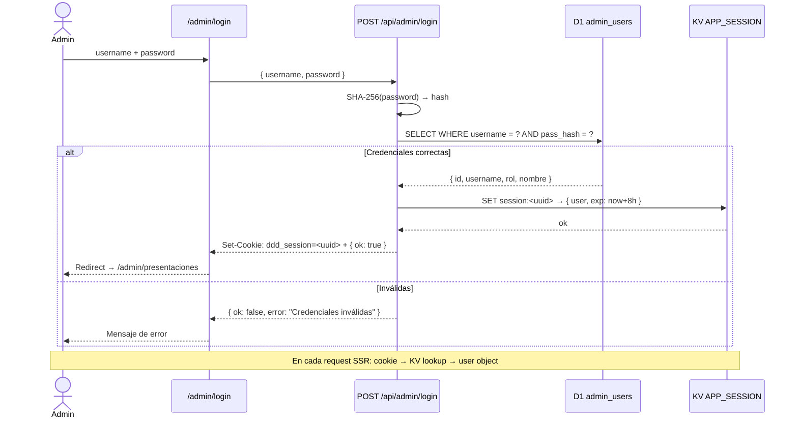
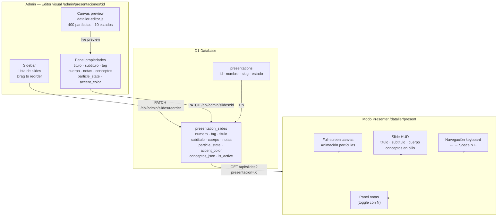
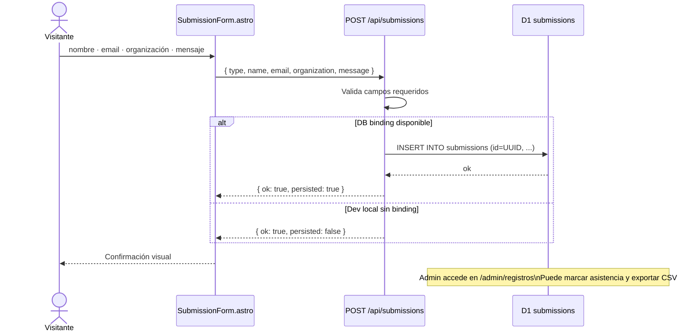
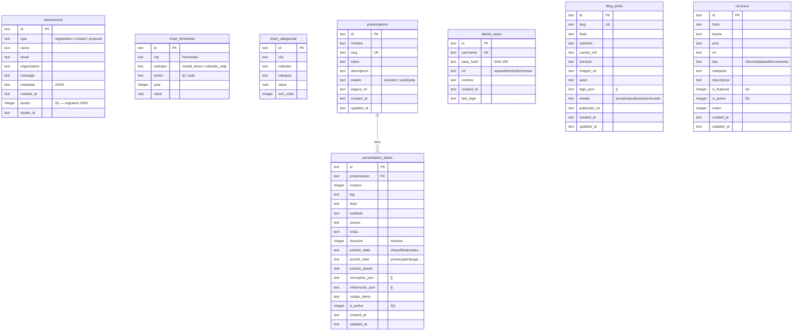
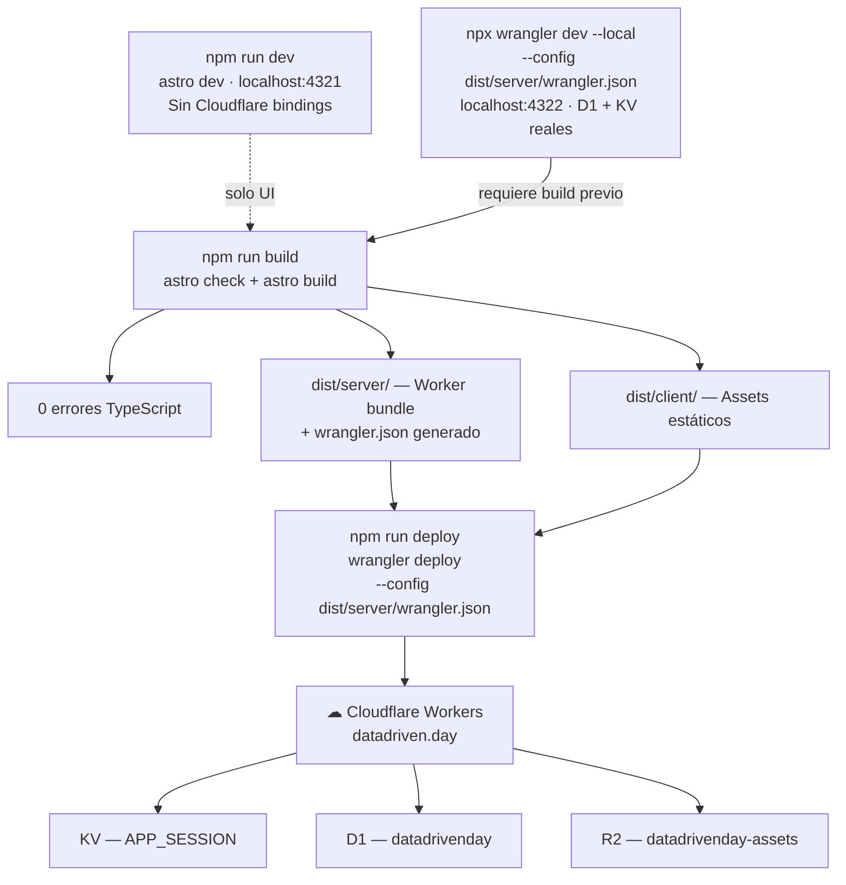

# Data Driven Day 2026

**Hermosillo, Sonora · 28 de marzo de 2026**

Plataforma web completa para el **Dataller de IA 2026**: sitio público, sistema de registros, CMS de blog y recursos, editor visual de presentaciones con canvas animado y modo presenter, todo corriendo en Cloudflare Workers + D1 + KV.

---

## Contenido

- [Arquitectura general](#arquitectura-general)
- [Stack técnico](#stack-técnico)
- [Estructura del proyecto](#estructura-del-proyecto)
- [Rutas y páginas](#rutas-y-páginas)
- [API — endpoints completos](#api--endpoints-completos)
- [Sistema admin](#sistema-admin)
- [Flujo de autenticación](#flujo-de-autenticación)
- [Flujo de presentaciones](#flujo-de-presentaciones)
- [Flujo de registro de participantes](#flujo-de-registro-de-participantes)
- [Modelo de base de datos](#modelo-de-base-de-datos)
- [Flujo de deploy](#flujo-de-deploy)
- [Setup local](#setup-local)
- [Variables de entorno](#variables-de-entorno)
- [Bindings Cloudflare](#bindings-cloudflare)
- [Scripts](#scripts)

---

## Arquitectura general



---

## Stack técnico

| Capa | Tecnología | Versión | Rol |
|------|-----------|---------|-----|
| Framework | [Astro](https://astro.build) | 6 | Páginas SSR + prerender, componentes |
| Runtime | [Cloudflare Workers](https://workers.cloudflare.com) | — | Edge compute, SSR, API |
| API | [Hono](https://hono.dev) | — | Rutas `/api/*` montadas sobre Workers |
| Base de datos | [Cloudflare D1](https://developers.cloudflare.com/d1/) | SQLite | 7 tablas: submissions, slides, blog, recursos, admin |
| Sesiones | [Cloudflare KV](https://developers.cloudflare.com/kv/) | — | Sesiones admin con TTL 8h |
| Storage | [Cloudflare R2](https://developers.cloudflare.com/r2/) | — | Imágenes blog, PDFs, media |
| CMS editorial | [Sanity](https://sanity.io) | — | Blog público (opcional, fallback si no configurado) |
| Estilos | CSS custom properties | — | Sistema de diseño propio, sin framework CSS |
| Tipografía | DM Sans + DM Mono | — | Display + código / UI |

---

## Estructura del proyecto

```
datadrivenday/
├── src/
│   ├── components/
│   │   ├── SubmissionForm.astro      # Formulario de registro → POST /api/submissions
│   │   ├── HermosilloHarvard.astro   # Componente datos ciudad
│   │   └── admin/
│   │       └── AdminLayout.astro     # Shell del panel admin (sidebar + topbar)
│   ├── data/
│   │   └── site.ts                   # Contenido estático: stats, agenda, navigation
│   ├── layouts/
│   │   └── BaseLayout.astro          # Shell HTML público
│   ├── lib/
│   │   ├── api/
│   │   │   ├── app.ts                # App Hono: registra todas las rutas
│   │   │   ├── auth.ts               # Auth: SHA-256, KV sessions, RBAC
│   │   │   ├── types.ts              # AppBindings, AppVariables, SubmissionPayload
│   │   │   └── routes/
│   │   │       ├── admin-presentations.ts  # CRUD presentaciones + slides
│   │   │       ├── admin-blog.ts           # CRUD artículos blog
│   │   │       ├── admin-registros.ts      # Ver/exportar registros
│   │   │       └── admin-recursos.ts       # CRUD biblioteca de recursos
│   │   ├── sanity/
│   │   │   └── content.ts            # getEventSettings(): fetch GROQ
│   │   └── server/
│   │       ├── assets.ts             # Helpers R2
│   │       └── db/
│   │           ├── submissions.ts    # insertSubmission()
│   │           └── slides.ts         # CRUD presentations + presentation_slides
│   ├── pages/
│   │   ├── index.astro               # Home (prerender)
│   │   ├── dataller.astro            # Documento dataller público (prerender)
│   │   ├── dataller/
│   │   │   └── present.astro         # Modo presenter full-screen (SSR)
│   │   ├── hermosillo.astro          # Datos ciudad (prerender)
│   │   ├── blog/index.astro          # Blog (prerender)
│   │   ├── datos/index.astro         # Biblioteca datos (prerender)
│   │   ├── manual/index.astro        # Documentación (prerender)
│   │   ├── admin/
│   │   │   ├── index.astro           # Dashboard → redirect a presentaciones
│   │   │   ├── login.astro           # Login admin
│   │   │   ├── presentaciones/
│   │   │   │   ├── index.astro       # Lista presentaciones
│   │   │   │   └── [id].astro        # Editor visual de slides
│   │   │   ├── blog/
│   │   │   │   ├── index.astro       # Lista artículos
│   │   │   │   └── [id].astro        # Editor artículo
│   │   │   ├── registros/index.astro # Tabla de participantes registrados
│   │   │   └── recursos/index.astro  # Biblioteca de recursos
│   │   └── api/
│   │       └── [...route].ts         # Handler catch-all → Hono app
│   ├── sanity/
│   │   └── schemaTypes/              # Schemas Sanity: article, eventSettings
│   └── styles/
│       └── global.css                # Sistema de diseño completo
├── db/
│   ├── migrations/
│   │   ├── 0001_initial.sql          # submissions
│   │   ├── 0002_chart_data.sql       # chart_timeseries, chart_categorical
│   │   ├── 0003_slides.sql           # presentations, presentation_slides, admin_users
│   │   ├── 0004_blog.sql             # blog_posts
│   │   ├── 0005_recursos.sql         # recursos
│   │   └── 0006_submissions_asistencia.sql  # ALTER submissions (asistio)
│   └── seed-dataller.sql             # Presentación + 9 slides del Dataller 2026
├── public/
│   ├── scripts/
│   │   └── dataller-editor.js        # Engine partículas canvas (400 particles, 10 estados)
│   └── styles/
│       ├── admin.css                 # Estilos panel admin
│       └── editor.css                # Estilos editor de slides
├── astro.config.mjs
├── wrangler.jsonc                    # Bindings + vars Cloudflare
├── sanity.config.ts
└── tsconfig.json
```

---

## Rutas y páginas



---

## API — endpoints completos

### Públicos (sin auth)

| Método | Path | Descripción |
|--------|------|-------------|
| `GET` | `/api/health` | Health check |
| `POST` | `/api/submissions` | Registro de participante |
| `GET` | `/api/city-data/:city` | Datos de ciudad (charts) |
| `GET` | `/api/slides?presentacion=` | Slides activos de una presentación |
| `GET` | `/api/blog` | Artículos públicos publicados |
| `GET` | `/api/blog/:slug` | Artículo por slug |
| `GET` | `/api/recursos` | Recursos activos |
| `GET` | `/api/media/*` | Proxy R2 |

### Admin — autenticación

| Método | Path | Descripción |
|--------|------|-------------|
| `POST` | `/api/admin/login` | Login → crea sesión KV |
| `POST` | `/api/admin/logout` | Elimina sesión KV |
| `GET` | `/api/admin/me` | Usuario actual |
| `GET` | `/api/admin/dashboard` | Stats generales |

### Admin — presentaciones y slides

| Método | Path | Permiso |
|--------|------|---------|
| `GET` | `/api/admin/presentaciones` | `presentations:read` |
| `POST` | `/api/admin/presentaciones` | `presentations:write` |
| `PATCH` | `/api/admin/presentaciones/:id` | `presentations:write` |
| `DELETE` | `/api/admin/presentaciones/:id` | `presentations:delete` |
| `GET` | `/api/admin/slides?presentacion=` | `presentations:read` |
| `POST` | `/api/admin/slides` | `presentations:write` |
| `PATCH` | `/api/admin/slides/:id` | `presentations:write` |
| `DELETE` | `/api/admin/slides/:id` | `presentations:delete` |
| `POST` | `/api/admin/slides/reorder` | `presentations:write` |
| `POST` | `/api/admin/slides/:id/duplicate` | `presentations:write` |

### Admin — blog, registros, recursos

| Método | Path | Permiso |
|--------|------|---------|
| `GET/POST` | `/api/admin/blog` | `blog:read/write` |
| `GET/PATCH/DELETE` | `/api/admin/blog/:id` | `blog:read/write/delete` |
| `POST` | `/api/admin/blog/:id/publicar` | `blog:publish` |
| `GET` | `/api/admin/registros` | `registros:read` |
| `GET` | `/api/admin/registros/export` | `registros:export` |
| `PATCH` | `/api/admin/registros/:id/asistio` | `registros:read` |
| `GET/POST` | `/api/admin/recursos` | `recursos:read/write` |
| `PATCH/DELETE` | `/api/admin/recursos/:id` | `recursos:write/delete` |
| `POST` | `/api/admin/recursos/reorder` | `recursos:write` |

---

## Sistema admin



---

## Flujo de autenticación



---

## Flujo de presentaciones



---

## Flujo de registro de participantes



---

## Modelo de base de datos



---

## Flujo de deploy



> **Importante:** Para el dev server con bindings reales (admin, base de datos), usar siempre `wrangler dev` con `--config dist/server/wrangler.json`. El `astro dev` en puerto 4321 no tiene acceso a D1/KV.

---

## Setup local

### 1. Clonar e instalar

```bash
git clone https://github.com/badouintec/datadrivenday.git
cd datadrivenday
npm install
```

### 2. Variables de entorno

```bash
cp .env.example .env
# Edita el .env con tus valores
```

### 3. Build inicial (requerido para wrangler dev)

```bash
npm run build
```

### 4. Aplicar migraciones al D1 local

```bash
# Aplica las 6 migraciones
for f in db/migrations/000*.sql; do
  npx wrangler d1 execute datadrivenday --local \
    --config dist/server/wrangler.json --file="$f"
done

# Seed: presentación + 9 slides del Dataller
npx wrangler d1 execute datadrivenday --local \
  --config dist/server/wrangler.json --file=db/seed-dataller.sql

# Usuario admin (pass: ddd2026admin)
npx wrangler d1 execute datadrivenday --local \
  --config dist/server/wrangler.json \
  --command="INSERT OR REPLACE INTO admin_users \
  (id,username,pass_hash,rol,nombre) VALUES \
  ('admin-001','admin','4eb1d27ff4a93d049ce93f06a5e793838385cce7fd59abd8fba4fbc16af651dc','superadmin','Administrador')"
```

### 5. Servidor de desarrollo con bindings

```bash
npx wrangler dev --config dist/server/wrangler.json --local --port 4322
# http://localhost:4322
# http://localhost:4322/admin → login: admin / ddd2026admin
```

> Si solo necesitas iterar sobre UI sin el admin, puedes usar `npm run dev` (puerto 4321) — más rápido, sin migraciones.

---

## Variables de entorno

| Variable | Requerida | Descripción |
|----------|-----------|-------------|
| `PUBLIC_SITE_URL` | Sí | URL pública sin trailing slash |
| `SANITY_PROJECT_ID` | Solo CMS | ID proyecto Sanity |
| `SANITY_DATASET` | Solo CMS | Dataset Sanity (default `production`) |
| `PUBLIC_SANITY_PROJECT_ID` | Solo CMS | Mismo ID, expuesto al cliente |
| `PUBLIC_SANITY_DATASET` | Solo CMS | Mismo dataset, expuesto al cliente |
| `SANITY_API_VERSION` | No | Default `2025-03-01` |

> Sin Sanity configurado el sitio carga con contenido fallback y no rompe.

---

## Bindings Cloudflare

Configura `wrangler.jsonc` con los IDs reales antes del primer deploy:

```jsonc
{
  "kv_namespaces": [{ "binding": "APP_SESSION", "id": "TU_KV_ID" }],
  "d1_databases": [{
    "binding": "DB",
    "database_name": "datadrivenday",
    "database_id": "TU_D1_ID",
    "migrations_dir": "db/migrations"
  }],
  "r2_buckets": [{ "binding": "MEDIA", "bucket_name": "datadrivenday-assets" }]
}
```

### Provisioning inicial

```bash
wrangler kv namespace create APP_SESSION
wrangler d1 create datadrivenday
wrangler r2 bucket create datadrivenday-assets
```

### Generar tipos de bindings

```bash
npm run cf-typegen
# Actualiza src/env.d.ts
```

---

## Scripts

| Comando | Descripción |
|---------|-------------|
| `npm run dev` | Astro dev server `localhost:4321` (solo UI, sin bindings) |
| `npm run build` | `astro check` + build de producción |
| `npm run preview` | Preview estático del build |
| `npm run preview:worker` | Build + `wrangler dev` con config generada |
| `npm run deploy` | Build + deploy a Cloudflare Workers |
| `npm run cf-typegen` | Regenera tipos de bindings en `src/env.d.ts` |
| `npm run sanity` | Studio Sanity local |

### Dev con bindings (comando manual)

```bash
# Siempre con --config dist/server/wrangler.json para usar el D1 correcto
npx wrangler dev --config dist/server/wrangler.json --local --port 4322
```


