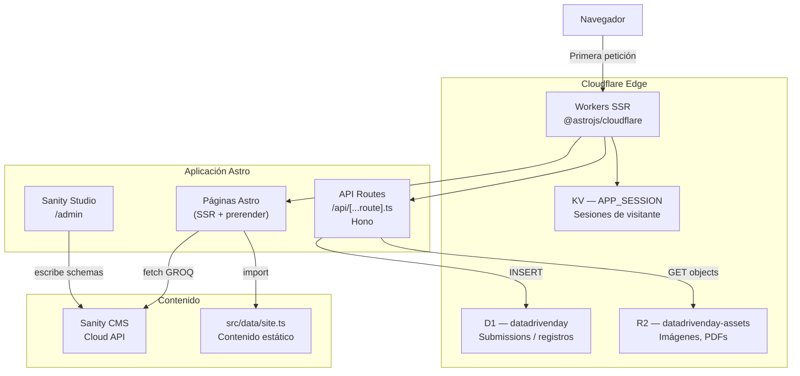
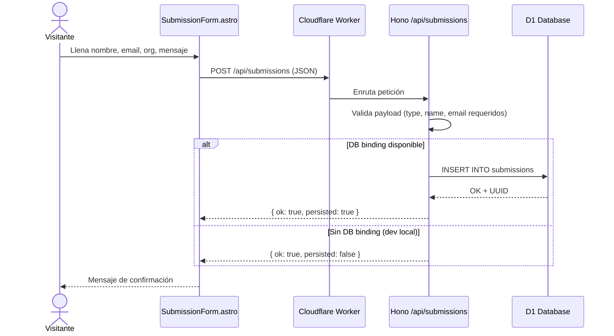
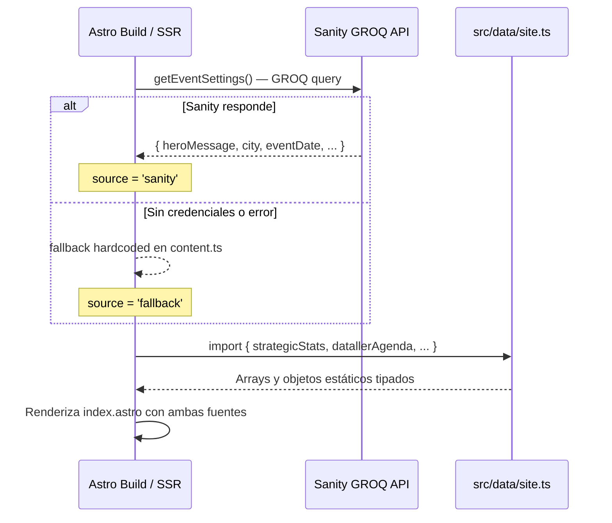
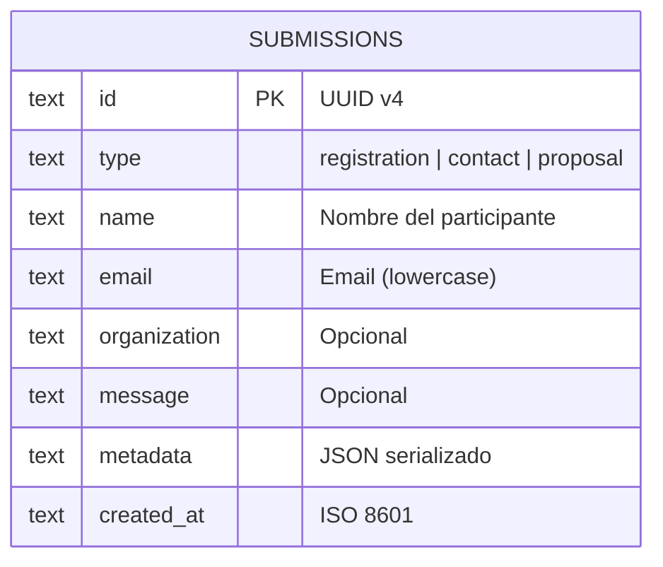
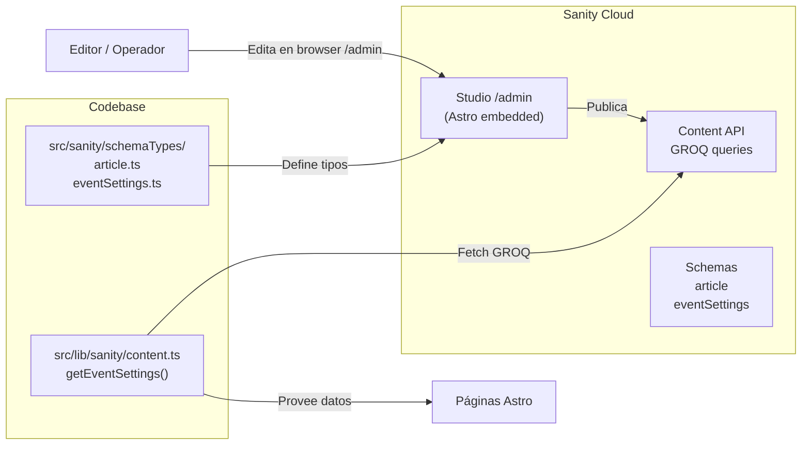
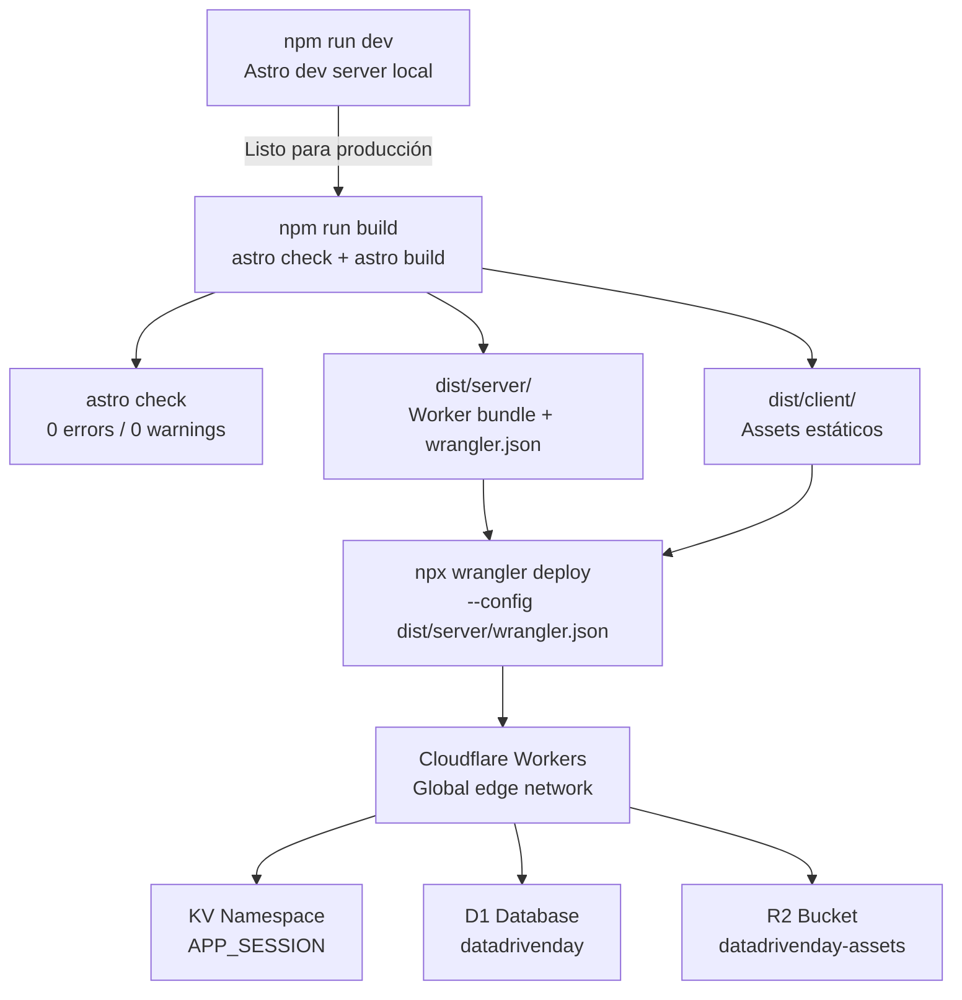

# Data Driven Day 2026

**Hermosillo, Sonora · Septiembre 18, 2026**

Plataforma web y proyecto editorial para impulsar una agenda regional de soberanía de datos, infraestructura crítica e inteligencia aplicada. El sitio convoca a la edición 2026, documenta el **Dataller de IA** como evento central, y conecta a gobierno, industria, academia y salud alrededor de temas urgentes para la ciudad.

---

## Contenido

- [Arquitectura general](#arquitectura-general)
- [Stack técnico](#stack-técnico)
- [Estructura del proyecto](#estructura-del-proyecto)
- [Flujo de datos](#flujo-de-datos)
- [Modelo de base de datos](#modelo-de-base-de-datos)
- [Flujo de contenido con Sanity](#flujo-de-contenido-con-sanity)
- [Flujo de deploy](#flujo-de-deploy)
- [Setup local](#setup-local)
- [Variables de entorno](#variables-de-entorno)
- [Bindings Cloudflare](#bindings-cloudflare)
- [Scripts](#scripts)

---

## Arquitectura general



---

## Stack técnico

| Capa | Tecnología | Rol |
|------|-----------|-----|
| Frontend | [Astro](https://astro.build) 5 | Páginas SSR, componentes, layouts |
| Runtime | [Cloudflare Workers](https://workers.cloudflare.com) | Edge compute, SSR, API |
| API | [Hono](https://hono.dev) | Rutas `/api/*` ligeras sobre Workers |
| Base de datos | [Cloudflare D1](https://developers.cloudflare.com/d1/) | Submissions, registros, contacto |
| Storage | [Cloudflare R2](https://developers.cloudflare.com/r2/) | Imágenes, PDFs, assets de evento |
| Sesiones | [Cloudflare KV](https://developers.cloudflare.com/kv/) | Compatibilidad de sesiones del adaptador |
| CMS | [Sanity](https://sanity.io) | Contenido editorial: agenda, speakers, posts |
| Estilos | CSS custom properties | Sistema de diseño propio, sin framework CSS |
| Tipografía | Syne + Public Sans | Google Fonts, display + texto |

---

## Estructura del proyecto

```
datadrivenday/
├── src/
│   ├── components/
│   │   └── SubmissionForm.astro    # Formulario de registro conectado a /api/submissions
│   ├── data/
│   │   └── site.ts                 # Contenido estático: stats, agenda, cards, recursos
│   ├── layouts/
│   │   └── BaseLayout.astro        # Shell HTML, nav, footer, scripts de animación
│   ├── lib/
│   │   ├── api/
│   │   │   ├── app.ts              # App Hono: /health, /submissions
│   │   │   └── types.ts            # Tipos compartidos: AppBindings, SubmissionPayload
│   │   ├── sanity/
│   │   │   └── content.ts          # getEventSettings(): fetch GROQ desde Sanity
│   │   └── server/
│   │       ├── assets.ts           # Helpers para R2
│   │       └── db/
│   │           └── submissions.ts  # insertSubmission(): INSERT a D1
│   ├── pages/
│   │   ├── index.astro             # Home: hero, métricas, pillars, dataller, form
│   │   ├── blog/index.astro        # Blog / bitácora editorial
│   │   ├── datos/index.astro       # Recursos y biblioteca de datos
│   │   ├── manual/index.astro      # Documentación operativa
│   │   └── api/
│   │       └── [...route].ts       # Handler que monta la app Hono
│   ├── sanity/
│   │   └── schemaTypes/            # Schemas de Sanity: article, eventSettings
│   └── styles/
│       └── global.css              # Sistema de diseño completo
├── db/
│   └── migrations/                 # SQL para D1 (schema de submissions)
├── public/                         # Assets estáticos (favicon, etc.)
├── astro.config.mjs
├── wrangler.jsonc                  # Config Cloudflare: bindings, vars
├── sanity.config.ts
└── tsconfig.json
```

---

## Flujo de datos

### Registro de un participante



### Carga de contenido editorial



---

## Modelo de base de datos



El schema se provisiona con las migraciones en `db/migrations/`. Para aplicar localmente:

```bash
npm run db:migrate:local
```

---

## Flujo de contenido con Sanity



El CMS controla en tiempo real:
- `heroMessage` — texto del hero en producción
- `city`, `eventDate` — datos del evento
- Artículos de blog y recursos editoriales

Si Sanity no está configurado, el sitio usa valores fallback definidos en `content.ts` y nunca rompe.

---

## Flujo de deploy



> **Nota:** Astro genera `dist/server/wrangler.json` durante el build con la config final del Worker. El `wrangler.jsonc` de la raíz solo guarda bindings y variables compartidas entre entornos.

---

## Setup local

### 1. Clonar e instalar

```bash
git clone https://github.com/badouintec/datadrivenday.git
cd datadrivenday
npm install
```

### 2. Variables de entorno

```bash
cp .env.example .env
# Edita el .env con tus valores
```

### 3. Base de datos local

```bash
npm run db:migrate:local
# Aplica las migraciones en .wrangler/state/v3/d1
```

### 4. Levantar servidor de desarrollo

```bash
npm run dev
# http://localhost:4321
```

### 5. Preview en Worker local (opcional)

```bash
npm run build
npm run preview:worker
# Emula Cloudflare Workers con wrangler
```

---

## Variables de entorno

Copia `.env.example` a `.env` y configura:

| Variable | Requerida | Descripción |
|----------|-----------|-------------|
| `PUBLIC_SITE_URL` | Sí | URL pública del sitio (sin trailing slash) |
| `SANITY_PROJECT_ID` | Sí (CMS) | ID de tu proyecto en Sanity |
| `SANITY_DATASET` | Sí (CMS) | Dataset de Sanity (por defecto `production`) |
| `PUBLIC_SANITY_PROJECT_ID` | Sí (CMS) | Mismo ID, expuesto al cliente para el Studio |
| `PUBLIC_SANITY_DATASET` | Sí (CMS) | Mismo dataset, expuesto al cliente |
| `SANITY_API_VERSION` | No | Versión de la API Sanity (default: `2025-03-01`) |

> Si no configuras Sanity, el sitio carga con contenido fallback y no rompe. El Studio en `/admin` no funcionará sin las variables.

---

## Bindings Cloudflare

Configura `wrangler.jsonc` con los IDs reales antes del primer deploy:

```jsonc
{
  "kv_namespaces": [{ "binding": "APP_SESSION", "id": "REEMPLAZAR" }],
  "d1_databases": [{ "binding": "DB", "database_id": "REEMPLAZAR" }],
  "r2_buckets": [{ "binding": "MEDIA", "bucket_name": "datadrivenday-assets" }]
}
```

### Provisioning inicial

```bash
# KV para sesiones
wrangler kv namespace create APP_SESSION

# D1 para submissions
wrangler d1 create datadrivenday

# R2 para assets
wrangler r2 bucket create datadrivenday-assets
```

Copia los IDs devueltos por cada comando a `wrangler.jsonc`.

### Generar tipos de bindings

```bash
npm run cf-typegen
# Actualiza src/env.d.ts con los tipos correctos de D1, R2 y KV
```

---

## Scripts

| Comando | Descripción |
|---------|-------------|
| `npm run dev` | Servidor de desarrollo Astro en `localhost:4321` |
| `npm run build` | Type-check (`astro check`) + build de producción |
| `npm run preview` | Preview estático del build |
| `npm run preview:worker` | Preview en Worker local con Wrangler |
| `npm run deploy` | Build + deploy a Cloudflare Workers |
| `npm run cf-typegen` | Genera tipos TypeScript desde `wrangler.jsonc` |
| `npm run db:migrate:local` | Aplica migraciones SQL a D1 local |

---

## Páginas públicas

| Ruta | Archivo | Descripción |
|------|---------|-------------|
| `/` | `src/pages/index.astro` | Home: hero, métricas, Dataller, formulario de registro |
| `/blog` | `src/pages/blog/index.astro` | Bitácora editorial del proyecto |
| `/datos` | `src/pages/datos/index.astro` | Biblioteca de recursos y datos abiertos |
| `/manual` | `src/pages/manual/index.astro` | Documentación operativa |
| `/admin` | Sanity Studio (embedded) | CMS de contenido (requiere auth) |
| `/api/health` | Hono | Health check del Worker |
| `/api/submissions` | Hono | POST registros al evento |

---

## Créditos

**Data Driven Day** es un proyecto independiente con base en Hermosillo, Sonora.  
Edición 2026 · datos, ciudad e inteligencia aplicada.


## Endpoints incluidos

- `GET /api/health`
- `POST /api/submissions`

La home ya incluye un formulario conectado a `POST /api/submissions` para validar el flujo desde UI.

## Contenido con Sanity

- Si `PUBLIC_SANITY_PROJECT_ID` y `PUBLIC_SANITY_DATASET` están configurados con valores reales, la home y `/blog` intentan leer contenido desde Sanity.
- Si no están configurados, o si la consulta falla, ambas páginas hacen fallback a contenido local para mantener `build`, `preview` y `deploy` estables.
- Esto permite migrar contenido gradualmente sin bloquear el despliegue del sitio.

Ejemplo de body para submissions:

```json
{
  "type": "registration",
  "name": "Ada Lovelace",
  "email": "ada@example.com",
  "organization": "Tec de Monterrey",
  "message": "Quiero recibir noticias del evento"
}
```

## Sanity Studio

La integración queda preparada en `/admin`.

Schemas iniciales:

- `article`
- `eventSettings`

## Migración sugerida

1. Migrar contenido real del home y agenda.
2. Pasar blog y FAQ a Sanity.
3. Conectar formularios al endpoint de Hono.
4. Mover media pesada a R2.
5. Reemplazar placeholders y activar analítica real.

## Documentacion complementaria

- `DOCUMENTACION_PROYECTO.md`: analisis completo del sitio legacy.
- `PLAN_MIGRACION_Y_SETUP.md`: guia operativa para provisionar infraestructura y mover contenido al nuevo stack.
