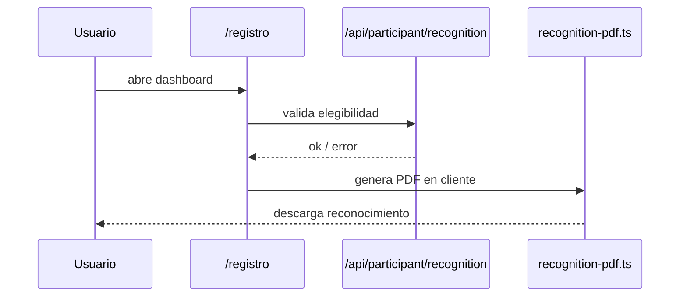

# Data Driven Day 2026

Plataforma web para el Dataller de IA 2026: sitio publico, dashboard de participantes, panel admin, sistema de presentaciones, recursos, blog y despliegue en Cloudflare Workers.

## Estado actual

- Runtime principal: Astro 6 + Cloudflare Workers + Hono.
- Datos: D1 para persistencia, KV para sesiones, R2 para media.
- CMS editorial: Sanity opcional.
- Dashboard participante activo en `/registro`.
- Reconocimiento PDF validado en backend y generado actualmente en cliente desde `/registro`.
- Presentaciones con editor admin, endpoint publico de slides y modo presenter.
- Documentacion viva centralizada en `docs/`.

## Arquitectura

```mermaid
flowchart TB
    Browser[Browser] --> Astro[Astro pages]
    Browser --> API[/api/* via Hono/]

    subgraph Public[Public pages]
        Home[/]
        Dataller[/dataller]
        Hermosillo[/hermosillo]
        Datos[/datos]
        Manual[/manual]
        Blog[/blog]
    end

    subgraph Dynamic[Dynamic views]
        Registro[/registro]
        Presenter[/dataller/present]
        Admin[/admin/*]
    end

    Astro --> Public
    Astro --> Dynamic
    API --> D1[(D1)]
    API --> KV[(KV)]
    API --> R2[(R2)]
    Astro --> Sanity[(Sanity optional)]
```

## Flujo clave del reconocimiento



## Componentes principales

- `src/pages`: paginas Astro y entrypoint de API.
- `src/lib/api`: auth, rutas Hono y tipos.
- `src/lib/server/db`: acceso a D1.
- `src/lib/client`: logica cliente especializada, incluido el PDF del reconocimiento.
- `public/scripts`: comportamiento del dashboard y editor de presentaciones.
- `db/migrations`: esquema y evolucion de D1.

## Quick start

```bash
npm install
npm run dev
```

Build de validacion:

```bash
npm run build
```

Preview del worker:

```bash
npm run preview:worker
```

## Scripts utiles

- `npm run dev`: arranca Astro en local.
- `npm run dev:reset`: limpia puertos comunes y arranca dev.
- `npm run build`: corre `astro check` y luego build.
- `npm run preview:worker`: build + `wrangler dev` sobre la salida SSR.
- `npm run deploy`: build + deploy a Cloudflare.
- `npm run db:migrate:local`: aplica migraciones D1 local.
- `npm run db:migrate:remote`: aplica migraciones D1 remotas.
- `npm run sanity`: arranca Sanity Studio.

## Rutas operativas

- Publicas: `/`, `/dataller`, `/hermosillo`, `/datos`, `/manual`, `/blog`.
- Participante: `/registro` y `/api/participant/*`.
- Presentaciones: `/admin/presentaciones`, `/dataller/present`, `/api/slides`.
- Admin: `/admin/*` y `/api/admin/*`.

## Snapshot de auditoria

1. La mayor deuda actual es de documentacion y coherencia operativa, no de build roto.
2. El reconocimiento PDF tiene implementacion duplicada: existe una via server-side y otra client-side, pero la activa es la client-side.
3. No hay pruebas automatizadas ni scripts de lint dedicados fuera de `astro check` y build.
4. Hay datos fallback embebidos en API que ayudan en resiliencia, pero pueden ocultar deriva de datos si no se documentan.

## Documentacion

- [docs/README.md](./docs/README.md): indice de documentacion viva.
- [docs/ARCHITECTURE.md](./docs/ARCHITECTURE.md): mapa tecnico del sistema.
- [docs/AUDIT.md](./docs/AUDIT.md): auditoria tecnica actual.
- [docs/TODO.md](./docs/TODO.md): backlog priorizado.

## Nota operativa

Si cambias auth, reconocimiento, presentaciones, bindings Cloudflare o flujo de despliegue, actualiza `README.md` y `docs/` en el mismo cambio.
